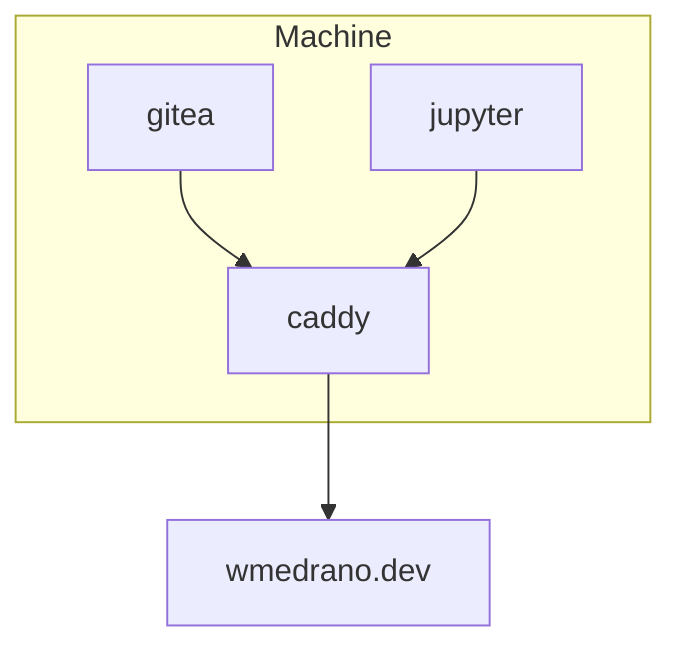

# wmedrano.dev

Configuration for wmedrano.dev. Initiated with `run.sh`.

## Gitea

Hosted software development control for Git. To first configure Gitea:

1. Visit `gitea.wmedrano.dev`.
1. Set the domain to `https://gitea.wmedrano.dev`.
1. Set the ssh port to `21895`. Note: The docker container still starts the ssh at port `22`, but `./docker-compose.yml` maps this to `21895`.

Further configuration options can be found in `./gitea/data/gitea/conf/app.ini`.
More documentation can be found on the [Gitea Configuration Cheat
Sheet](https://docs.gitea.io/en-us/config-cheat-sheet/).

## Jupyter

Web interactive Python coding environment. To set the password:

1. Attach a shell to the docker container.
1. Run `jupyter lab password`.
1. Reload the docker container.