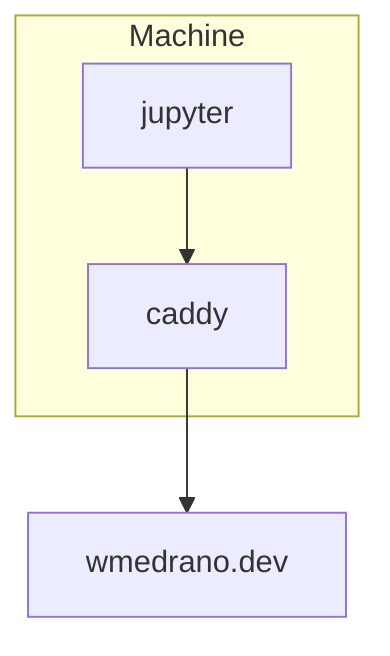

# wmedrano.dev

Configuration for wmedrano.dev. Initiated with `run.sh`.

## Jupyter

Web interactive Python coding environment. To set the password:

1. Attach a shell to the docker container.
1. Run `jupyter lab password`.
1. Reload the docker container.