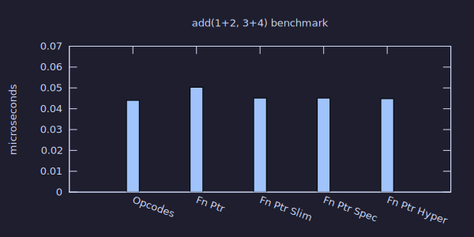
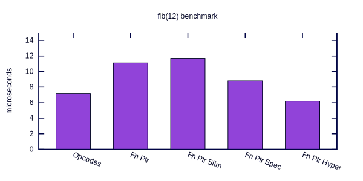

#+title: Functional Dispatch
#+date: 2026-03-31
#+author: Will S. Medrano

* Introduction
:PROPERTIES:
:ID:       021a6bcc-7349-4267-a6dd-1f3169a286f7
:END:

I was working on the 2D rendering library [[https://github.com/linebender/tiny-skia][Tiny Skia]] and was surprised to find a
little compiler and virtual machine for filling out a gradient. I was also
surprised that they compiled their sequence of instructions from an ~enum~ into
a sequence of ~function pointers~.

This got me curious on why? Is it faster? More flexible?

Spoiler: For my use case and set of benchmarks, the more compact ~enum~
implementation was generally faster. See the [[id:89620a29-0426-4063-8f03-fa8a5c7ba15d][Results section]].

#+caption: A two-point radial gradient

** Tiny Skia
:PROPERTIES:
:ID:       9b6fc685-08c5-4011-ba2d-5295c7ae91bc
:END:

Tiny Skia is a Rust library that handles 2D rendering on the CPU. It is fairly
performant and powers [[https://github.com/linebender/resvg][resvg]], the svg to png converter library/binary.

It has an interesting mechanism for computing gradients. Given a gradient spec,
Tiny Skia compiles to a ~Context~ to store parameters and a sequence of simple
~enum~ values for each opcode/instruction. However, at runtime, the sequence of
enums is converted into a sequence of function pointers that run one after
another.

#+CAPTION: Implementation of the Transform step. It tweaks some registers and moves on to the next stage.
#+BEGIN_SRC rust
fn transform(p: &mut Pipeline) {
    let ts = &p.ctx.transform;

    let (x, y) = (p.r, p.g);
    let tx = mad(x,
                 f32x8::splat(ts.sx),
                 mad(y, f32x8::splat(ts.kx), f32x8::splat(ts.tx)));
    let ty = mad(y,
                 f32x8::splat(ts.ky),
                 mad(y, f32x8::splat(ts.sy), f32x8::splat(ts.ty)));

    (p.r, p.g) = (tx, ty);
    p.next_stage(); // Fetches the next instruction and executes the function.
}
#+END_SRC

** Bytecode Interpreter? Function Pointers?
:PROPERTIES:
:ID:       8ca0d356-09ab-49f0-a695-0d2c95e16af5
:END:

*** Bytecode Interpreter
:PROPERTIES:
:ID:       758e9193-0daa-4aeb-babd-14ffb81deafb
:END:

A bytecode interpreter is a program that executes instructions encoded as
compact binary data (bytecode). A bytecode interpreter defines its own virtual
instruction set and executes it in a loop. This is the approach used by
languages like Python and Ruby.

The core of most bytecode interpreters is a /dispatch loop/.

| Step | Instruction                |
|------+----------------------------|
|    1 | Fetch the next instruction |
|    2 | Decode it                  |
|    3 | Execute it                 |
|    4 | Repeat.                    |

#+CAPTION: A simple Rust implementation uses an ~enum~ to represent instructions and a ~match~ to dispatch them.
#+BEGIN_SRC rust
impl Vm {
    fn run(&mut self) -> Result<Val> {
        let mut current_frame = self.stack_frames.pop().ok_or(Error::StackUnderflow)?;
        loop {
            match current_frame.next_instruction() {
                Instruction::LoadInt(x) => {
                    self.stack.push((x as i64).into());
                }
                ...
            }
        }
    }
}
#+END_SRC

*** Example
:PROPERTIES:
:ID:       493c352a-38f1-4fbf-b1b7-590d3b50e18e
:END:

For example, computing ~1 + 2~ compiles to three instructions. Each step either
pushes a value onto the stack or pops values and pushes a result:

| Step | Instruction | Stack  |
|------+-------------+--------|
|    1 | LoadInt(1)  | [1]    |
|    2 | LoadInt(2)  | [1, 2] |
|    3 | Binop(Add)  | [3]    |
|    4 | Return      | []     |

*** Performance Considerations
:PROPERTIES:
:ID:       567bfc52-eb44-4d66-9702-cee82a5eac91
:END:

The size of data structures is very important to an interpreter's
performance. Smaller datastructures are preferred as:

1. More data can fit in the CPU cache.
2. More data can fit in the CPU registers.
3. Less data to read and write.

Many virtual machines resort to storing both ~float64~ and ~pointer~ values in a
single ~8 byte~ value through [[https://craftinginterpreters.com/optimization.html#nan-boxing][NaN Boxing]][fn:64bit]. This is impressive
considering that both ~float64~ and ~pointers~ individually take ~8 bytes~, but
we can store them in a datastructure that itself takes ~8 bytes~. Similarly,
OCaml uses bit tagging to store either [[https://blog.janestreet.com/what-is-gained-and-lost-with-63-bit-integers/][=63bit int= or a pointer]].

Instructions are another dimension that can be shrunk — which is why the
function pointer approach is surprising: it uses a ~8 byte pointer~ instead of a
more compact enum opcode.

** Function Pointers vs Enum Instruction
:PROPERTIES:
:ID:       f41c09ff-8142-454b-b298-ef2a2e448dde
:END:

Since we want to shrink the size of data, using a function pointer[fn:fnptr]
instead of a more compact representation is interesting. Although it may induce
more cache pressure, there is less processing that needs to happen to dispatch
the function call. However, a function call in itself has some overhead.

Let's convert the instructions into function pointers.

#+CAPTION: Enum-based dispatch (before)
#+BEGIN_SRC rust
impl Vm {
    fn run(&mut self) -> Result<Val> {
        let mut current_frame = self.stack_frames.pop().ok_or(Error::StackUnderflow)?;
        loop {
            match current_frame.next_instruction() {
                Instruction::LoadInt(x) => {
                    self.stack.push((x as i64).into());
                }
                ...
            }
        }
    }
}
#+END_SRC

A simple way to translate to the new architecture is to tweak the function
implementations. Each instruction is now a function that

1. Performs some operation on the VM.
2. Continues on to the next instruction.[fn:tailcall]

#+CAPTION: Function pointer dispatch (after)
#+BEGIN_SRC rust
// An example instruction function
// 1. Perform action
// 2. Call the next function
pub(crate) fn load_int_fn(vm: &mut Vm, mut frame: StackFrame, data: u8) -> Result<Val> {
    vm.stack.push((data as i8 as i64).into());
    let (fn_ptr, data) = frame.advance_instruction_fn();
    // `become` is similar to `return`, but performs a tail call which should be more optimal.
    // See unstable feature: https://doc.rust-lang.org/std/keyword.become.html.
    become fn_ptr(vm, frame, data);
}

impl Vm {
    // Run loop executes functions.
    fn run(&mut self) -> Result<Val> {
        let mut frame = self.stack_frames.pop().ok_or(Error::StackUnderflow)?;
        let (func, data) = frame.advance_instruction_fn();
        (func)(self, frame, data)
    }
}
#+END_SRC

* Setup & Benchmark
:PROPERTIES:
:ID:       2560761a-1987-4788-bcd3-f9335997e0f8
:END:

I built a simple bytecode interpreter to test how the performance of the
function pointers approach is. Since it's just a toy, I made only the VM, no
parser. The repository can be found on [[https://github.com/wmedrano/function-ptr-experiment/commits/main/][GitHub]].

** Hypothesis
:PROPERTIES:
:ID:       d73da4b1-a415-4ea3-b761-7f848285e7e0
:END:

Function pointers should be slower as:

- They take more bytes to represent. The ~enum~ used in this interpreter uses =2
  bytes= vs the =8 bytes= for the function pointer and =1 byte= for the data
  byte. The =4.5x= increase in size means that fewer instructions fit in CPU
  cache, increasing cache pressure.
- Dispatching an enum should have lower overhead than even a tail function
  call. This is the part I'm less sure about, if you have any good resources on
  this, email me at will@wmedrano.dev. In addition to being less sure about
  this, the impact of the dispatch mechanism may change if we redesign
  representations or add/remove code.

** Instructions
:PROPERTIES:
:ID:       bda813fb-9d3b-4d5f-a8e0-ae2430f5a9e6
:END:

The following instruction set seems powerful enough to test. Don't worry,
despite looking small, instructions like ~Return~ and ~Eval~ have a lot of
complexity.

| Instruction  | Parameter | Description                                                                                                                     |
|--------------+-----------+---------------------------------------------------------------------------------------------------------------------------------|
| Eval         | i8        | Pop a =Func= from the stack and call it with =n= arguments. If =n= is negative, it's a recursive call with =n + 128= arguments. |
| Return       |           | Return from the current function.                                                                                               |
| LoadInt      | i8        | Push a small integer literal onto the stack.                                                                                    |
| LoadConst    | u8        | Push a constant from the function's constant table onto the stack.                                                              |
| LoadLocal    | u8        | Push a local variable (by index into the current stack frame) onto the stack.                                                   |
| SetLocal     | u8        | Set a local variable (by index into the current stack frame) from the top of the stack.                                         |
| JumpIf       | i8        | Skip the next =n= instructions if the top of the stack is truthy.                                                               |
| Jump         | i8        | Skip the next =n= instructions unconditionally.                                                                                 |
| Binop        | Binop     | Apply a binary operation to the top two stack values, leaving the result.                                                       |
| AddN         | i8        | Add a small integer literal to the top-of-stack integer in place.                                                               |
| LessThan     | i8        | Replace the top-of-stack integer with a bool: =top < n=.                                                                        |
| GreaterThan  | i8        | Replace the top-of-stack integer with a bool: =top > n=.                                                                        |
| Equal        | i8        | Replace the top-of-stack integer with a bool: =top == n=.                                                                       |
| StringLength |           | Replace the top-of-stack string with its integer length.                                                                        |
| Dup          | u8        | Duplicate the top-of-stack value.                                                                                               |

** Benchmark
:PROPERTIES:
:ID:       04315c2b-4c75-4916-b969-ccfdf7654a3f
:END:

I used ~add(1+2, 3+4)~ and ~fib(12)~ as the benchmark. I handcoded the following
bytecode functions for the stack based bytecode interpreter. The ~fib~ function
takes a single parameter that is stored at index =0=. The ~add~ function takes 4
arguments stored at index =0=, =1=, =2=, and =3=.

#+BEGIN_SRC rust
/// Register and return a recursive Fibonacci function.
///
/// Implements: `fib(n) = if n < 2 { n } else { fib(n-1) + fib(n-2) }`
pub fn make_fib() -> Val {
    Func::new(
        1,
        vec![
            Instruction::LoadLocal(0),      //  0: [n, n]
            Instruction::LessThan(2),       //  1: [n, n<2]
            Instruction::JumpIf(8),         //  2: [n]  -- if n<2 jump to 11
            Instruction::LoadLocal(0),      //  3: [n, n]
            Instruction::AddN(-1),          //  4: [n, n-1]
            Instruction::Eval(-127),        //  5: [n, fib(n-1)]
            Instruction::LoadLocal(0),      //  6: [n, fib(n-1), n]
            Instruction::AddN(-2),          //  7: [n, fib(n-1), n-2]
            Instruction::Eval(-127),        //  8: [n, fib(n-1), fib(n-2)]
            Instruction::Binop(Binop::Add), //  9: [n, fib(n-1)+fib(n-2)]
            Instruction::Return,            // 10: return fib(n-1)+fib(n-2)
            Instruction::LoadLocal(0),      // 11: [n, n]  -- base case (n < 2)
            Instruction::Return,            // 12: return n
        ],
        vec![],
    )
    .into()
}

pub fn make_adder() -> Val {
    Func::new(
        4,
        vec![
            Instruction::LoadLocal(0),      // 0: [a]
            Instruction::LoadLocal(1),      // 1: [a, b]
            Instruction::Binop(Binop::Add), // 2: [a+b]
            Instruction::LoadLocal(2),      // 3: [a+b, c]
            Instruction::LoadLocal(3),      // 4: [a+b, c, d]
            Instruction::Binop(Binop::Add), // 5: [a+b, c+d]
            Instruction::Binop(Binop::Add), // 6: [a+b+c+d]
            Instruction::Return,            // 7: return a+b+c+d
        ],
        vec![],
    )
    .into()
}
#+END_SRC

** Instruction Variants
:PROPERTIES:
:ID:       de4fce32-d163-418a-a1a9-26bcbe65c661
:END:

*** OpCodes: Enum Instructions
:PROPERTIES:
:ID:       45b0f924-9eaf-45f3-8929-52370077f6ea
:END:

With the simple op code based interpreter, the representation of a function is
mostly the instructions. The VM iterates and jumps around the ~instructions~.

#+BEGIN_SRC rust
#[derive(Debug, PartialEq)]
struct FuncInner {
    // The number of arguments this function takes.
    arg_count: usize,
    // The instructions for the function.
    instructions: Vec<Instruction>,
    // The table of constants. Instruction references this by index.
    constants: Vec<Val>,
}
#+END_SRC

*** Fn Ptr: Function pointer with data byte instruction
:PROPERTIES:
:ID:       dee86198-32e3-489d-8213-6797172a69c3
:END:

With function pointer, the ~Instruction~ enum is converted to a function and a
data byte. The data byte provides extra context for the function. The data byte
is used to store things for some instructions such as how many instructions to
jump or which argument to fetch.

#+BEGIN_SRC rust
#[derive(Debug, PartialEq)]
struct FuncInner {
    arg_count: usize,
    funcs: Vec<fn(&mut Vm, StackFrame, u8) -> Result<Val>>,
    data: Vec<u8>, // data[idx] contains context for funcs[idx]
    constants: Vec<Val>,
}

// An example instruction func.
pub(crate) fn load_int_fn(vm: &mut Vm, mut frame: StackFrame, data: u8) -> Result<Val> {
    vm.stack.push((data as i8 as i64).into());
    let (fn_ptr, data) = frame.advance_instruction_fn();
    // `become` is similar to `return`, but performs a tail call which should be more optimal.
    // See https://doc.rust-lang.org/std/keyword.become.html.
    become fn_ptr(vm, frame, data);
}
#+END_SRC

*** Fn Ptr Slim: Function pointer instruction
:PROPERTIES:
:ID:       d169555f-aba9-4045-95d6-db1d5191f401
:END:

This is similar to ~Fn Ptr~, but the data byte is not passed as a function
argument. Instead, instructions that need it fetch it themselves by manually
reading ~instruction_data~. Instructions that don't need a data byte (like
~Return~) skip the fetch entirely, potentially saving a memory read. The results
of the lazy fetching are hard to predict on a general virtual machine and really
depend on how often the data byte is needed.

#+BEGIN_SRC rust
#[derive(Debug, PartialEq)]
struct FuncInner {
    arg_count: usize,
    funcs: Vec<fn(&mut Vm, StackFrame) -> Result<Val>>,
    data: Vec<u8>, // data[idx] contains context for funcs[idx]
    constants: Vec<Val>,
}

// An example instruction func.
pub(crate) fn load_int_fn(vm: &mut Vm, mut frame: StackFrame) -> Result<Val> {
    let data = frame.func.instruction_data(frame.instruction_idx);
    vm.stack.push((data as i8 as i64).into());
    frame.instruction_idx += 1;
    let fn_ptr = frame.func.instruction(frame.instruction_idx);
    become fn_ptr(vm, frame);
}
#+END_SRC

*** Fn Ptr Spec: Specialization
:PROPERTIES:
:ID:       dc219e17-576e-4427-beff-94595cfb296b
:END:

This introduces more functions based on the instruction. It can be seen as
inlining some of the instructions parameters. Take the following compilation
code snippet and see how common parameters have a different path.

Take the following example:
1. The general ~add_n_fn~ fetches the data byte and adds it to the top value.
2. The optimized ~add_n_const_fn::<N>~ inlines the value that will be
   added. There is no fetching of the data byte, just performing the addition to
   the top value of the stack.

For a few common values, the optimized implementation may help. For =fibonacci=
specifically, this can be more optimal when performing the =n - 2= and =n - 1=
operations.

#+BEGIN_SRC rust
// Fast path
Instruction::AddN(-2) => (add_n_const_fn::<-2> as InstructionFn, 0),
Instruction::AddN(-1) => (add_n_const_fn::<-1> as InstructionFn, 0),
Instruction::AddN(0) => (add_n_const_fn::<0> as InstructionFn, 0),
Instruction::AddN(1) => (add_n_const_fn::<1> as InstructionFn, 0),
Instruction::AddN(2) => (add_n_const_fn::<2> as InstructionFn, 0),
// Slow path
Instruction::AddN(n) => (add_n_fn as InstructionFn, n as u8),
#+END_SRC

#+BEGIN_SRC rust
// The normal implementation.
pub(crate) fn add_n_fn(vm: &mut Vm, mut frame: StackFrame) -> Result<Val> {
    let data = frame.func.instruction_data(frame.instruction_idx);
    let top = vm.stack.last_mut().ok_or(Error::StackUnderflow)?;
    match top {
        Val::Int(x) => *x += data as i8 as i64,
        _ => {
            return Err(Error::WrongType {
                expected: "Int",
                got: top.type_name(),
            });
        }
    }
    frame.instruction_idx += 1;
    let fn_ptr = frame.func.instruction(frame.instruction_idx);
    become fn_ptr(vm, frame);
}

// A fast path implementation.
pub(crate) fn add_n_const_fn<const N: i64>(vm: &mut Vm, mut frame: StackFrame) -> Result<Val> {
    let top = vm.stack.last_mut().ok_or(Error::StackUnderflow)?;
    match top {
        Val::Int(x) => *x += N,
        _ => {
            return Err(Error::WrongType {
                expected: "Int",
                got: top.type_name(),
            });
        }
    }
    frame.instruction_idx += 1;
    let fn_ptr = frame.func.instruction(frame.instruction_idx);
    become fn_ptr(vm, frame);
}

#+END_SRC

*** Fn Ptr Hyper: Ridiculous level of specialization
:PROPERTIES:
:ID:       838a9737-afa4-4bf7-8e57-b4d75e0b1296
:END:

This adds two extra specializations. For the adder, ~triop_add_fn~ fuses two
consecutive ~Binop::Add~ instructions into a single three-operand add. This one
is rather simple compared to the =fibonacci= instruction...

For =fibonacci=, ~jump_if_local0_lt2_fn~ performs a jump if register ~0~ is less
than ~2~. The =enum -> function= converter automatically detects these patterns
and uses the specialized functions when appropriate.

~jump_if_local0_lt2_fn~ alone handles the first 3 operations in each =fibonacci=
call. This is significant as each =fibonacci= call executes 5 instructions for the
base case and 11 instructions for the recursive call case.

#+BEGIN_SRC rust
pub(crate) fn jump_if_local0_lt2_fn(vm: &mut Vm, mut frame: StackFrame) -> Result<Val> {
    let data = frame.func.instruction_data(frame.instruction_idx);
    let local0 = match &vm.stack[frame.stack_start] {
        Val::Int(x) => *x,
        top => {
            return Err(Error::WrongType {
                expected: "Int",
                got: top.type_name(),
            });
        }
    };
    let idx = if local0 < 2 {
        (1 + frame.instruction_idx as isize + data as i8 as isize) as usize
    } else {
        frame.instruction_idx + 1
    };
    frame.instruction_idx = idx;
    let fn_ptr = frame.func.instruction(idx);
    become fn_ptr(vm, frame);
}
#+END_SRC

* Results
:PROPERTIES:
:ID:       89620a29-0426-4063-8f03-fa8a5c7ba15d
:END:

** Numbers

#+NAME: results
| Implementation | add(1+2,3+4) (µs) | add delta | fib(12) (µs) | fib delta |
|----------------+-------------------+-----------+--------------+-----------|
| Opcodes        |            0.0440 |        0% |          7.2 |        0% |
| Fn Ptr         |            0.0503 |      +14% |         11.1 |      +54% |
| Fn Ptr Slim    |            0.0451 |       +3% |         11.7 |      +63% |
| Fn Ptr Spec    |            0.0451 |       +3% |          8.8 |      +22% |
| Fn Ptr Hyper   |            0.0448 |       +2% |          6.2 |      -13% |
#+TBLFM:

#+BEGIN_SRC gnuplot :file results-add.svg :exports results :term svg size 600,300
set style fill solid 0.8 border -1
set boxwidth 0.6
set yrange [0:0.07]
set ylabel "microseconds"
set title "add(1+2, 3+4) benchmark"
set key off
set xtics rotate by -20
set style line 1 lc rgb '#a020f0'

$data << EOD
"Opcodes" 0.044
"Fn Ptr" 0.0503
"Fn Ptr Slim" 0.0451
"Fn Ptr Spec" 0.0451
"Fn Ptr Hyper" 0.0448
EOD

plot $data using 0:2:xtic(1) with boxes ls 1
#+END_SRC

#+RESULTS:

#+BEGIN_SRC gnuplot :file results-fib.svg :exports results :term svg size 600,300
set style fill solid 0.8 border -1
set boxwidth 0.6
set yrange [0:15]
set ylabel "microseconds"
set title "fib(12) benchmark"
set key off
set xtics rotate by -20
set style line 1 lc rgb '#a020f0'
$data << EOD
"Opcodes" 7.2
"Fn Ptr" 11.1
"Fn Ptr Slim" 11.7
"Fn Ptr Spec" 8.8
"Fn Ptr Hyper" 6.2
EOD

plot $data using 2:xtic(1) with boxes ls 1
#+END_SRC

#+RESULTS:

** Performance
:PROPERTIES:
:ID:       a31f3c62-b932-4c36-ba23-c960d0059e30
:END:

*** Function Pointer
:PROPERTIES:
:ID:       fe798f01-1c56-49f3-808a-633496daef60
:END:

Function pointers are dramatically slower, but heavy specialization can beat
enum dispatch. The simple adder function takes =15%= longer with =fibonacci=
taking =54%= longer!

In the =Fn Ptr Slim=, instead of fetching =(next_function, databyte)=, we only
fetch =next_function=. The function itself will have to manually get the
databyte if needed. This one was better for =fibonacci=, but worse for
=add=. This is somewhat expected and depends on the code. if the =databyte= is
usually used, then prefetching it and storing it in the proper register is
good. If not, then copying it around just adds to our overhead.

*** Specialization
:PROPERTIES:
:ID:       d6cfc478-1fd2-4b52-8f8e-d11416fe6bd7
:END:

Specialization greatly improves the cost of =fibonacci= while the =add= is
around the same level. As a refresher, specialization allowed us to replace some
special instructions with more optimized versions. The main optimization is that
the functions have constants built-in instead of relying on the value in the
=databyte=.

#+CAPTION: The following special cases affected our benchmarks.
#+BEGIN_SRC rust
// Used in both fib and adder
Instruction::LoadLocal(0) => (load_local_const_fn::<0> as InstructionFn, 0),

// Used only in fib
Instruction::AddN(-2) => (add_n_const_fn::<-2> as InstructionFn, 0),
Instruction::AddN(-1) => (add_n_const_fn::<-1> as InstructionFn, 0),
Instruction::LessThan(2) => (less_than_const_fn::<2> as InstructionFn, 0),
Instruction::EvalRecursive(1) => (eval_recursive_const_fn::<1> as InstructionFn, 0),

// Used only in adder
Instruction::LoadLocal(1) => (load_local_const_fn::<1> as InstructionFn, 0),
Instruction::LoadLocal(2) => (load_local_const_fn::<2> as InstructionFn, 0),
Instruction::LoadLocal(3) => (load_local_const_fn::<3> as InstructionFn, 0),

#+END_SRC

For hyper specialization, I added the silly ~jump_if_local0_lt2_fn~ function
which greatly improves performance for =fibonacci= and this pushes it ahead of
the original instruction =enum= based implementation. The adder benchmark only
gets the ~triop_add_fn~ specialization which was a tiny win; We could probably
muck around with better specializations to optimize =add= further, but it's not
a very good exercise.

The takeaway here is that with the added flexibility, we can hack up some
functions to improve our benchmark scores. Two microbenchmarks aren't enough to
characterize a dispatch mechanism. Results may look very different with a more
diverse or realistic workload.

#+begin_quote
*Note*: As the interpreter evolves, the performance implications may change. As
we add more complexity and branches, function pointers give the branch predictor
a stable target per instruction type. A large =match= has a single indirect
branch with many possible targets.
#+end_quote

** Readability & Maintainability
:PROPERTIES:
:ID:       6f853762-53a2-47b4-bf74-b3f3ed1413cf
:END:

Despite being a bit slower, it was actually easier to add specialized
instructions when using functions. ~jump_if_local0_lt2_fn~ was easy to patch in
without increasing complexity too much. To implement ~jump_if_local0_lt2_fn~ we
had to implement the Rust function and the compiler optimziation pass. The pass
that introduces the function is rather simple:

#+BEGIN_SRC rust
// Pattern: LoadLocal(0), LessThan(2), JumpIf(n) -> combined fast path + 2 nops.
if let (
    Some(Instruction::LoadLocal(0)),
    Some(Instruction::LessThan(2)),
    Some(Instruction::JumpIf(n)),
) = (
    instructions.get(i),
    instructions.get(i + 1),
    instructions.get(i + 2),
) {
    funcs.extend_from_slice(&[
        jump_if_local0_lt2_fn as InstructionFn,
        nop_fn as InstructionFn,
        nop_fn as InstructionFn,
    ]);

    // The combined instruction sits at the LoadLocal(0) slot, so the jump offset
    // must be increased by 2 to reach the same target as the original JumpIf.
    data.extend_from_slice(&[n as u8 + 2, 0, 0]);
    i += 3;
    continue;
}
#+END_SRC

** Future Work
:PROPERTIES:
:ID:       62b4b71a-b318-4c67-b043-b5afef0519e1
:END:

The next thing I want to try out is using the bare enum in Tiny Skia instead of
the [[https://github.com/linebender/tiny-skia/blob/main/src/pipeline/highp.rs#L59][function table]]. Unlike a general interpreter, Tiny Skia runs a predetermined
pipeline that is repeatedly applied across many pixels. This use case is much
different than a general purpose interpreter so I'm not sure what the results
will be.

* Footnotes
:PROPERTIES:
:ID:       49b48ced-71e4-4d70-a32f-cde514b3ddc0
:END:

[fn:fnptr] In this post, "function" and "function pointer" are used
interchangeably. In Rust, a function pointer (~fn(...) -> ...~) is a pointer to
a function, so referencing a function by name gives you a function pointer.

[fn:tailcall] A tail call is used to reduce function call overhead. This may or
may not automatically be done by the Rust compiler. See [[https://github.com/rust-lang/rust/issues/112788][explicit_tail_calls
support on GitHub]].

[fn:64bit] I assume 64-bit machines in this post to simplify things. On 64-bit
machines, pointers are 8 bytes.
