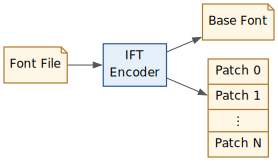
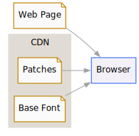
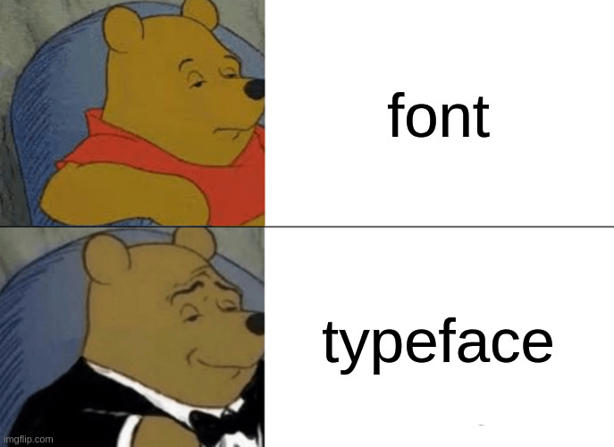

#+title: Fonts Q1
#+date: <2026-04-11 Sat>
#+author: Will S. Medrano

* Introduction
:PROPERTIES:
:ID:       8441fc9d-1865-439c-95de-5de5833e41f0
:END:

I just completed my first full quarter on my new team[fn:startdate], the Google
Fonts team. It went about as I expected; I learned a lot of stuff, but wish I
had learned it all faster.

So what does the Google Fonts team do? Quite a bit of random stuff here and
there, some of it internal to Google, and some of it open source. It's easy to
talk about the more open stuff than the internal.

** Google Fonts
:PROPERTIES:
:ID:       eae09021-7a19-4c3f-acd7-c48c0c58f804
:END:

The easiest thing to explain under my team's purview is [[https://fonts.google.com/][fonts.google.com]]. You
have probably used this! Many websites use Google Fonts as a CDN and LLMs even
seem to default to Google Fonts as the source of fonts.

Google Fonts lets you browse and select from a catalog of fonts. Once selected,
you can embed the font files into your website.

#+CAPTION: Google Fonts Embed
#+BEGIN_SRC html
<link rel="preconnect" href="https://fonts.googleapis.com">
<link rel="preconnect" href="https://fonts.gstatic.com" crossorigin>
<link href="https://fonts.googleapis.com/css2?family=Baskervville:wght@700&family=Sen:wght@400..800&display=swap" rel="stylesheet">
#+END_SRC

The neat part about the Google Fonts API is thatit provides the font hosting. No
need to download and serve the fonts. If you look at the generated CSS, you can
see a few different technologies to better serve fonts.

#+CAPTION: Note the use of =woff2= and =unicode-range= to serve only the required glyphs. This page actually only needs the /latin/ range.
#+BEGIN_SRC css
/* latin-ext */
@font-face {
  font-family: 'Baskervville';
  font-style: normal;
  font-weight: 700;
  src: url(https://fonts.gstatic.com/s/baskervville/v20/YA9Br0yU4l_XOrogbkun3kQ6vLFYXmpq8sRsYgfsigq4dC1F.woff2) format('woff2');
  unicode-range: U+0100-02BA, U+02BD-02C5, U+02C7-02CC, U+02CE-02D7, U+02DD-02FF, U+0304, U+0308, U+0329, U+1D00-1DBF, U+1E00-1E9F, U+1EF2-1EFF, U+2020, U+20A0-20AB, U+20AD-20C0, U+2113, U+2C60-2C7F, U+A720-A7FF;
}
/* latin */
@font-face {
  font-family: 'Baskervville';
  font-style: normal;
  font-weight: 700;
  src: url(https://fonts.gstatic.com/s/baskervville/v20/YA9Br0yU4l_XOrogbkun3kQ6vLFYXmpq8sRsYgfsigS4dA.woff2) format('woff2');
  unicode-range: U+0000-00FF, U+0131, U+0152-0153, U+02BB-02BC, U+02C6, U+02DA, U+02DC, U+0304, U+0308, U+0329, U+2000-206F, U+20AC, U+2122, U+2191, U+2193, U+2212, U+2215, U+FEFF, U+FFFD;
}
/* latin-ext */
@font-face {
  font-family: 'Sen';
  font-style: normal;
  font-weight: 400 800;
  src: url(https://fonts.gstatic.com/s/sen/v12/6xKjdSxYI9_3kvWNEmo.woff2) format('woff2');
  unicode-range: U+0100-02BA, U+02BD-02C5, U+02C7-02CC, U+02CE-02D7, U+02DD-02FF, U+0304, U+0308, U+0329, U+1D00-1DBF, U+1E00-1E9F, U+1EF2-1EFF, U+2020, U+20A0-20AB, U+20AD-20C0, U+2113, U+2C60-2C7F, U+A720-A7FF;
}
/* latin */
@font-face {
  font-family: 'Sen';
  font-style: normal;
  font-weight: 400 800;
  src: url(https://fonts.gstatic.com/s/sen/v12/6xKjdSxYI9_3nPWN.woff2) format('woff2');
  unicode-range: U+0000-00FF, U+0131, U+0152-0153, U+02BB-02BC, U+02C6, U+02DA, U+02DC, U+0304, U+0308, U+0329, U+2000-206F, U+20AC, U+2122, U+2191, U+2193, U+2212, U+2215, U+FEFF, U+FFFD;
}
#+END_SRC

** Font Compiler
:PROPERTIES:
:ID:       346f6172-0f28-4b18-b41f-a27789e7c580
:END:

Google maintains and develops [[https://github.com/googlefonts/fontc][fontc]], a Rust-based compiler that takes font sources
and converts them into ttf/otf files. It's a lot quicker than the previous Python
font compiler, [[https://github.com/googlefonts/fontmake][fontmake]], which was also developed and maintained by Google.

** Fontations
:PROPERTIES:
:ID:       412ffb16-9652-4652-bb99-d3abac6383b3
:END:

The Rust [[https://github.com/googlefonts/fontations][Fontations]] libraries provide a foundation to read and write font
data. This library is used in =fontc= as well as Skia, the 2D graphics engine
used by Chrome, Chromium, Firefox, and Android.

* Accomplishments
:PROPERTIES:
:ID:       b806dbeb-ba06-497c-8f8d-3d733cff1d16
:END:

I did a few things that are internal to Google, but most of my work has been
open source. Since it's open source, I can actually present some of the stuff
I've done.

** Better Gradients for Resvg+TinySkia

*** Task

My starter project was to fix [[https://github.com/googlefonts/sleipnir][Sleipnir]] rendering of color fonts like
[[https://fonts.google.com/specimen/Nabla?query=nabla&preview.script=Latn][Nabla]]. Sleipnir is a Rust library that can render text and icons into png or
svg.

This one was quite a rabbit hole. The most important skill I picked up was
understanding the font format. Fonts (ttf/otf files) are composed of tables. The
tables define things such as contours, supported unicodes, ligatures, kerning,
and lots of other stuff; it's a fairly extensible format.

To inspect the contents of a font, you can open it with the =ttx= command from
[[https://github.com/fonttools/fonttools][fonttools]]. This produces an =xml= representation of the tables. To help me out,
I even made an Emacs package that adds the ability to open ttf, otf, and
woff2[fn:woff2] font files. Check out [[https://github.com/wmedrano/ttx-mode][=ttx-mode=]] if interested.

*** Detour

It turns out that getting Nabla to work was not too complicated. However, the
underlying 2D graphics library did not have the full expressiveness of Radial
Gradients and was missing Sweep Gradients entirely. I originally was going to
leave it as is, but my manager encouraged me to continue. So I ended up learning
some math and implementing [[https://github.com/linebender/tiny-skia/pull/164][radial gradient]] and [[https://github.com/linebender/tiny-skia/pull/166][sweep gradients]].

What's rewarding about this is that it affects a few other users. Once /typst/
updates their dependencies, they should have better gradients ([[https://github.com/typst/typst/issues/7760][issues]]). I also
[[https://github.com/linebender/resvg/pull/1014][completed]] /resvg/ integration to better render radial gradients. Both of these
are pretty popular open source tools.

** IFT - Incremental Font Transfer
:PROPERTIES:
:ID:       3642f9d0-72a4-417b-b4b1-8e39420c65f4
:END:

*** Background
:PROPERTIES:
:ID:       5bb31103-5b81-476f-a9d3-079015baac71
:END:

The main project I should be working on at the moment is landing IFT on the
client. I said should since I've spent most of this quarter procrastinating and
failing to comprehend specs. At least I've made a bit of progress.

IFT stands for Incremental Font Transfer. It is a font technology that
theoretically enables more efficient transfer of fonts. One of my coworkers has
been working on the spec and prototype for a while. He's done a great job at
authoring the [[https://www.w3.org/TR/IFT/][W3 Spec]] for it.

IFT requires 2 components:

1. A font must be IFT encoded. This splits the font into a base font and a
   collection of patches.
2. Client support. Clients (web browsers) must be able to request and apply the
   patches as needed.

#+BEGIN_SRC dot :file ift-encoder.svg :exports results
digraph IFT {
  rankdir=LR;
  node [fontname="sans-serif"; fontsize=12; shape=record;];
  font [label="Font File"];
  base [label="Base Font"];
  patches [label="Patch 0|Patch 1|⋮|Patch N"];
  encoder [label="IFT\nEncoder"];
  font -> encoder;
  encoder -> base;
  encoder -> patches;
}
#+END_SRC

#+CAPTION: The encoder converts a font file into a font and its patches.
#+ATTR_HTML: :style width:50%;
#+RESULTS:

#+BEGIN_SRC dot :file ift-client.svg :exports results
digraph IFTClient {
  rankdir=LR;
  node [fontname="sans-serif"; fontsize=12; shape=record;];

  webpage [label="Web Page"];
  browser [label="Browser"];

  subgraph cluster_cdn {
    label="CDN";
    color=gray;
    fontname="sans-serif";
    fontsize=12;

    basefont [label="Base Font"];
    patches [label="Patches"];
  }

  webpage -> browser;
  basefont -> browser;
  patches -> browser;
}
#+END_SRC

#+CAPTION: The client must download and apply the relevant patches at runtime.
#+ATTR_HTML: :style width:33%;
#+RESULTS:

So why is it useful to split up a font? This is all to reduce download sizes and
make things load quickly and more consistently. When using a font, a web page
may not need all the glyphs (characters) or styles (italic/bold/underline).

*** Actual Deliverables
:PROPERTIES:
:ID:       0894041b-86cb-4551-818e-95c382fee073
:END:

Well, I've been really procrastinating on this since it's rather
intimidating. I've read some spec, IFT code, and Chromium code, but that's not
really a deliverable[fn:ift-progress].

However, at the end of the quarter I managed to squeeze in =fonttools= support
([[https://github.com/fonttools/fonttools/pull/4072][PR]]). This allows us to inspect the =IFT= table with the very useful =ttx=
tool[fn:ttx]. This is useful for debugging the feature as =IFT= contains all the
metadata for defining the available patches.

*** Next
:PROPERTIES:
:ID:       ac6005e1-8823-4c19-be1e-b92839a10764
:END:

My Q2 goal is to have working IFT support in the browser. This means understanding
the Chromium code, implementing the feature, and shipping it behind a flag.

** An Appreciation for Typeface

#+CAPTION: It's a typeface Steve.
#+ATTR_HTML: :style width:50%;margin:auto;

I've also gained an appreciation for typeface[fn:typeface]. I've liked tweaking
around the monospace font I use after I started programming. Here's where I've
landed for now:

| Context | Purpose     | Typeface     | Designer                         |
|---------+-------------+--------------+----------------------------------|
| OS      | Interface   | [[https://indestructibletype.com/Jost.html][Jost*]]        | [[https://indestructibletype.com/BuyJost.html][indestructible type*]] (Owen Earl) |
| OS      | Body Text   | [[https://rsms.me/inter/][Inter]]        | [[https://rsms.me/inter/download/][rsms]]  (Rasmus)                   |
| OS      | Terminal    | [[http://levien.com/type/myfonts/inconsolata.html][Inconsolata]]  | [[https://github.com/raphlinus][raphlinus]] ([[https://tug.org/tc/devfund/][TUG]] for funding)      |
| OS/Blog | Code        | [[https://github.com/tonsky/FiraCode][Fira Code]]    | [[https://carrois.com/studio/][Carrois Type Design]] & [[https://github.com/tonsky][tonsky]]     |
| Blog    | Blog Header | [[https://anrt-nancy.fr/en/fonts/baskervville][Baskervville]] | [[https://anrt-nancy.fr/en][ANRT]] ([[https://www.rosaliewagner.com/][Rosalie Wagner]] & [[https://ko-fi.com/rosaliewagner][ko-fi]])    |
| Blog    | Body Text   | [[https://philatype.com/sen][Sen]]          | [[https://philatype.com/][PHILATYPE]] (Kosal Sen)            |

* Footnotes
:PROPERTIES:
:ID:       94bb74e4-b31a-4b91-bc53-55343586c83d
:END:

[fn:startdate] I actually started on the team in late November, but it's a short
quarter between all the holidays, nobody being present, and some unexpected sick
days.

[fn:woff2] A woff2 font is just a compressed version of a font.

[fn:ift-progress] At the time this was written, my grasp is a lot better. That's
a relief, but it would be a 2026Q2 update!

[fn:ttx] You know, the thing I talked about earlier. The font file to xml
converter.

[fn:typeface] Typeface is the design, for example, the Helvetica typeface. The
font is the digital representation manifested into bytes.
